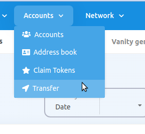
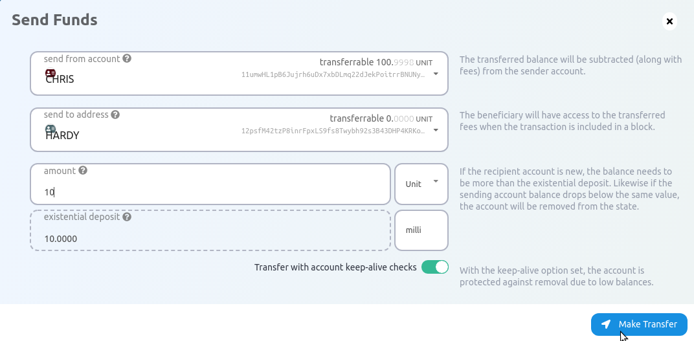
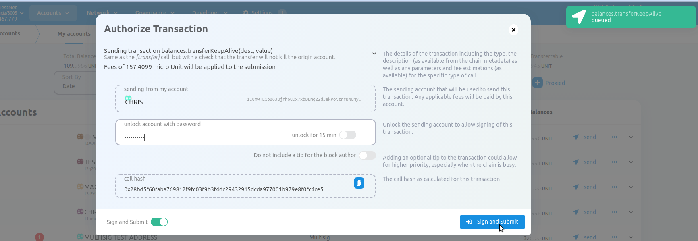

# **Balance Transfers**
Balance transfers are used to send balance from one account to another account. To start transferring balances, we will begin by using [AXscan](https://axscan.test.axiacoin.network/?rpc=wss%3A%2F%2Fwss.test.axiacoin.network#/explorer). This guide assumes that you've already created an account and have some funds that are ready to be transferred.
## AXscan

Let's begin by opening [AXscan](https://axscan.test.axiacoin.network/?rpc=wss%3A%2F%2Fwss.test.axiacoin.network#/explorer). There are two ways to make a balance transfer:

1. By using the "Transfer" tab in the "Accounts" dropdown (located on the top navigational menu).
2. Clicking the "send" button while in the "Accounts" page.

### Using the Transfer Tab

Click on the "Transfer" tab in the "Accounts" dropdown.

Now a modal window will appear on the page. The modal asks you to enter 3 inputs:

- "send from account": Your account with funds that you will send from.
- "send to address": The address of the account that will receive the funds.
- "amount": The amount of tokens you will transfer.

The "existential deposit" box shows you the **minimum amount of funds you must keep in the account
for it to remain active.**

After setting your inputs correctly, click the "Make Transfer" button and confirm. Once the transfer
is included in a block you will see a green notification in the top-right corner of your screen.

After that you have to give the password of your account to authorize the transaction. Then click on "Sign and Submit". Within few second the amount will be transferred from your account to another account.

[AXIA Support](https://discord.gg/ebjsN9ByMb) - Connect with our community of experts to learn or ask.

