### How to create an account
After downloading AXwallet from the Google Play Store, it will show a interface like this:

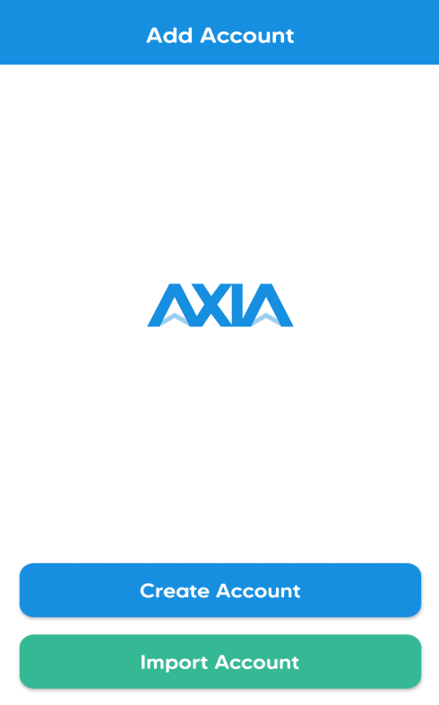

Here you can see two options
* Create Account
* Import Account

### Create Account

In order to create a new account you can click on the `Create Account` button.

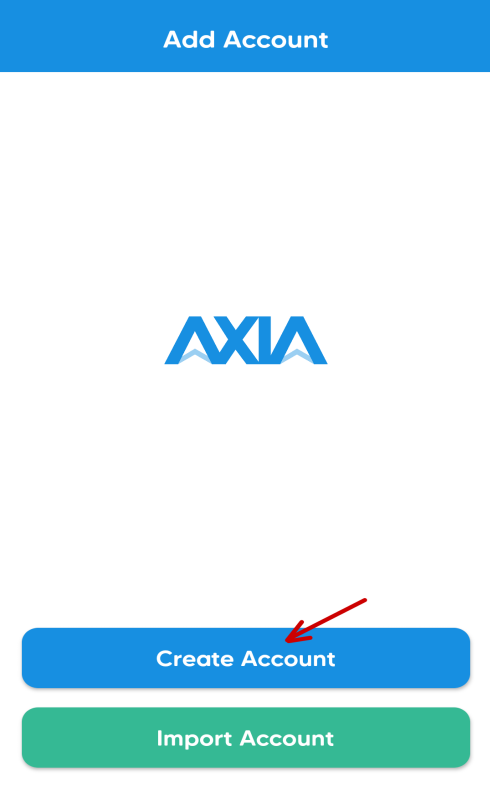

Then it will give some information about the application.

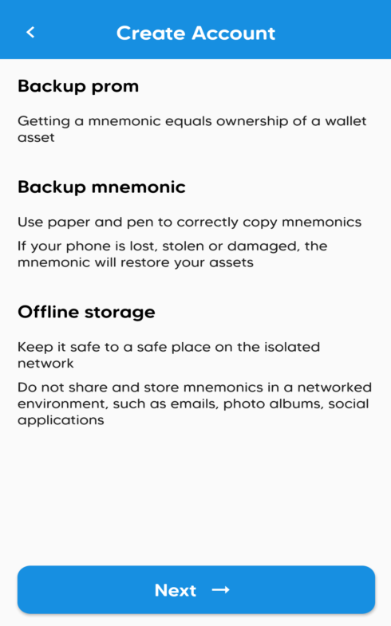

By pressing on the `Next` button it will generate a Twelve words Backup mnemonic.

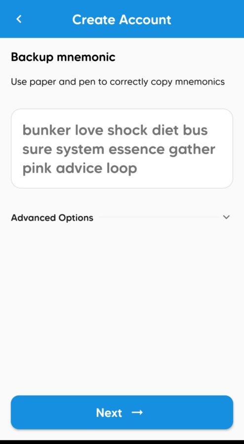

On the next page you have to confirm the mnemonic and press `Next`. 

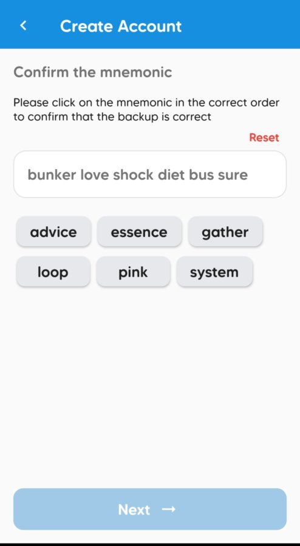

Now you have to give the Name and Password of the account. 

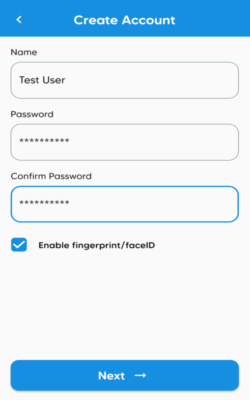

Your account will be added in the AXwallet application.

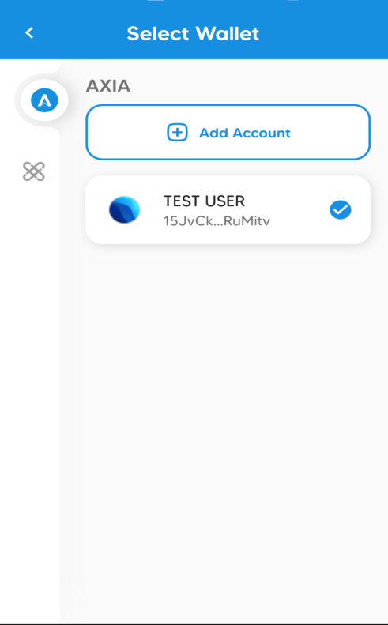

## Import Account

In order to Import an existing account click on the `Import Account` button.

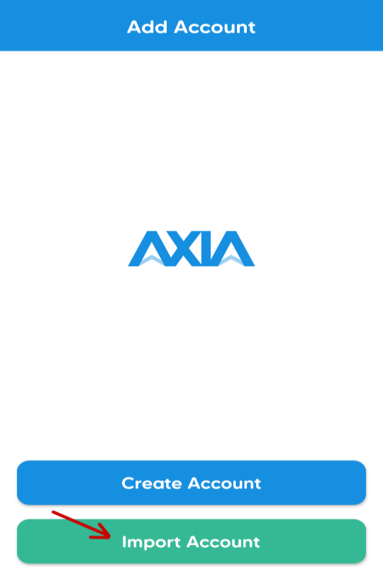

In the next screen you can select Mnemonic as the Source Type and give the `Twelve words Mnemonic` or You can select Raw Seed as the Source Type and put the `Raw Seed` that you have already generated during your account generation.

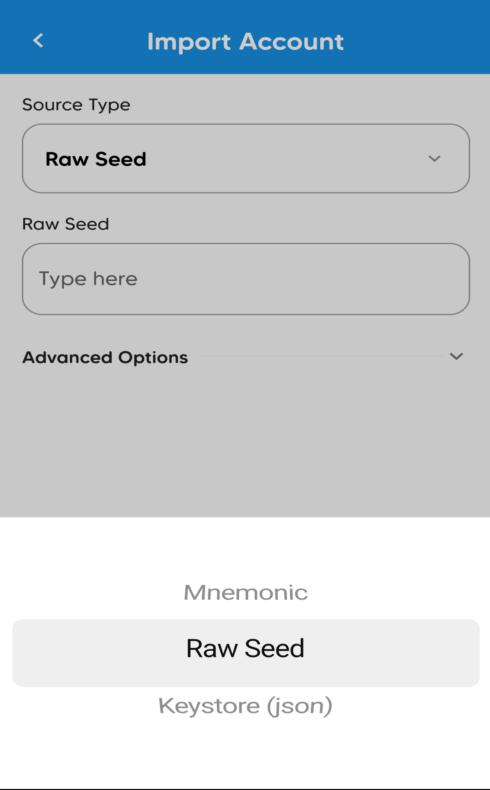

You can also import your account by the Keystore(json) in this option you have to give the account Name and Password.

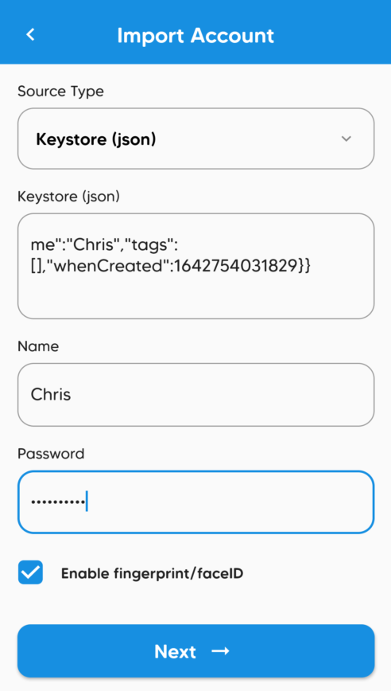

 After a few seconds it will import your existing account

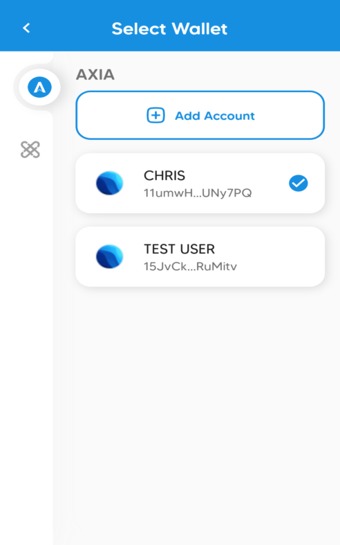

[AXIA Support](https://discord.gg/ebjsN9ByMb) - Connect with our community of experts to learn or ask.

