### How to Transfer Balance
Click the top right icon of the application

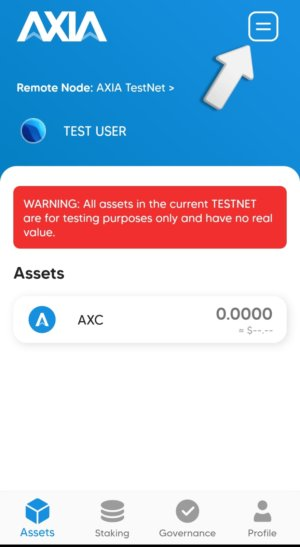

Select a account which have some funds

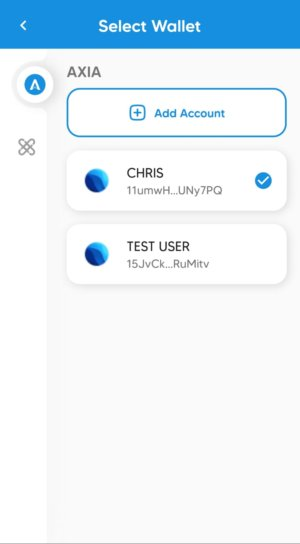

Click the `AXC` under the Assets

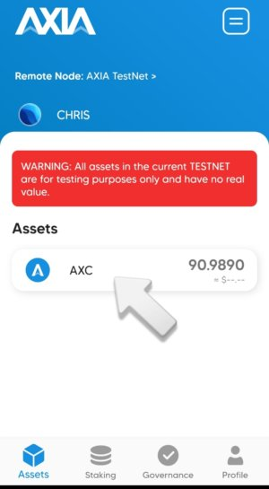

It will show an interface like this. In the down below there are two options `Receive` and `Transfer`.

By clicking `Receive` it will show a QR code with the wallet address.

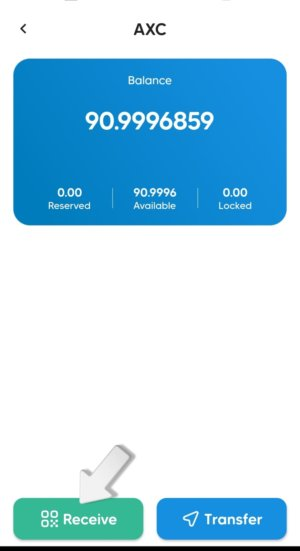

One can scan the QR code or copy this address to send the AXC.

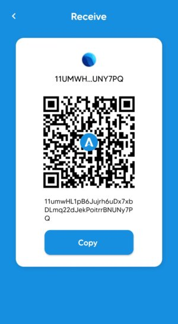

With `Transfer` you can send some AXC to other accounts. 

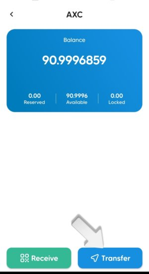

By clicking the scan icon on the top right corner.

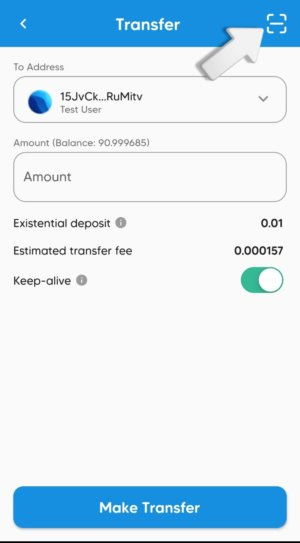

You can aslo scan the QR code of another account

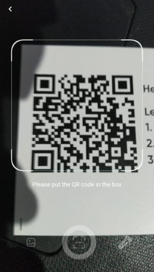

Or you can give a address manually or select some existing address

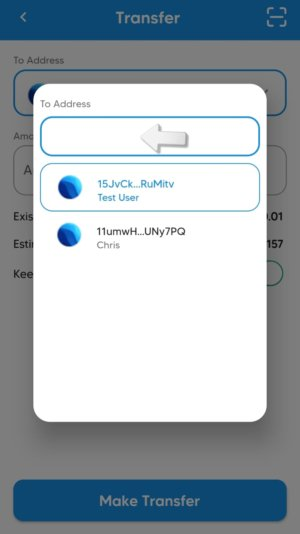

Type some amount in the box and click on `Make Transfer`

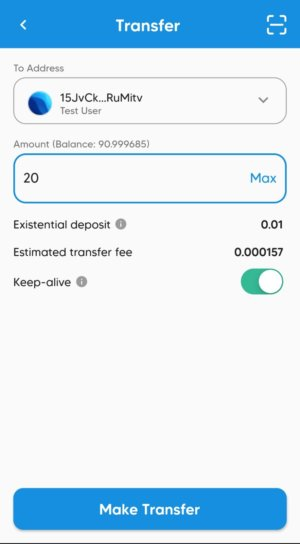

You can see the Transaction details. Click `Submit` to make the transfer.

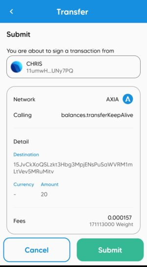

It will ask for Authentication like your fingerprint 

or you have to give the password of your account

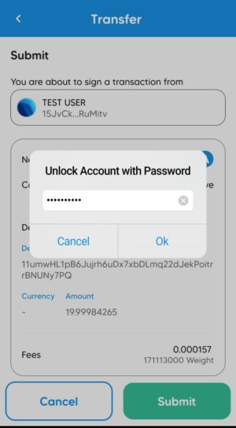

It will take few seconds.

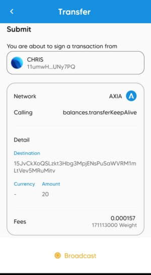

AXC's are deducted from your account and the AXC has successfully transferred from the account to the desired account.

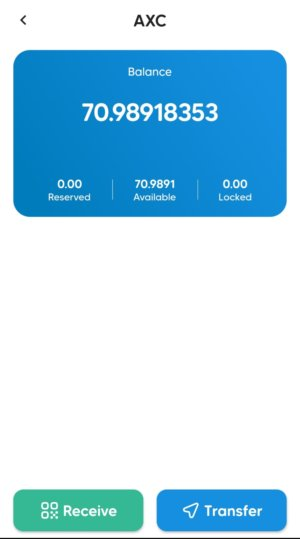

You can go and check the change will be reflected.

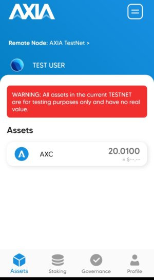

[AXIA Support](https://discord.gg/ebjsN9ByMb) - Connect with our community of experts to learn or ask.

