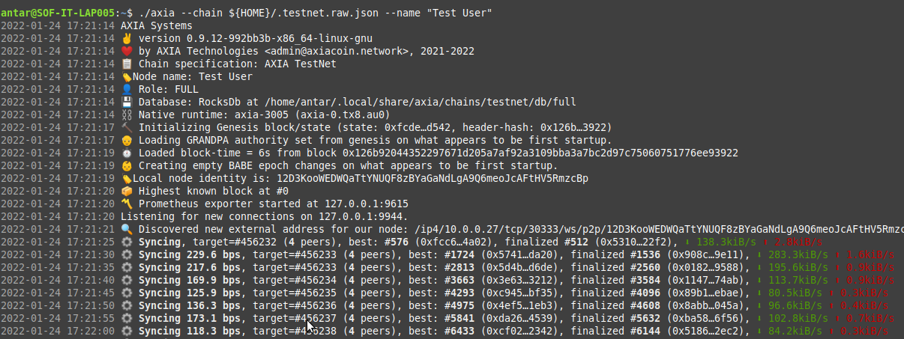

## How to setup the AXIA Network peer node in your Linux system: 
### System Requirements :
* For this guide we will be using Linux Mint 20.1 Cinnamon but the instructions should be similar for Ubuntu 16.04 or higher versions.
* CPU- Intel Core i5-7200U CPU @ 2.50GHz x 2
* Storage- 1 TB
* Memory- 8 GB

### Install Rust & Dependencies
```bash
sudo apt-get update 

sudo apt-get install -y git clang curl libssl-dev llvm libudev-dev expect net-tools wget librust-openssl-dev python3-dev python3 python3-pip

curl -sSLk https://sh.rustup.rs -o /tmp/rustup.sh

chmod +x /tmp/rustup.sh

/tmp/rustup.sh   # Press 1

source $HOME/.cargo/env

rm -f /tmp/rustup.sh
```
### Download Binary & TestNet Specs
```bash
RELEASE_URL="https://releases.axiacoin.network/stable/axia"

wget -c ${RELEASE_URL} ; chmod +x ./axia

wget -c https://releases.axiacoin.network/stable/testnet.raw.json -O ${HOME}/.testnet.raw.json
```
### Running TestNet Chain (Exact Replica of Upcoming MainNet)
```bash
./axia --chain ${HOME}/.testnet.raw.json --name "Your Node Name"
```


[AXIA Support](https://discord.gg/ebjsN9ByMb) - Connect with our community of experts to learn or ask.
