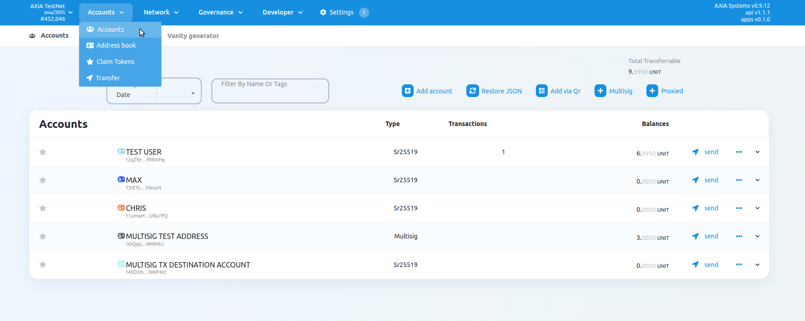
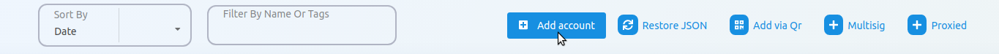
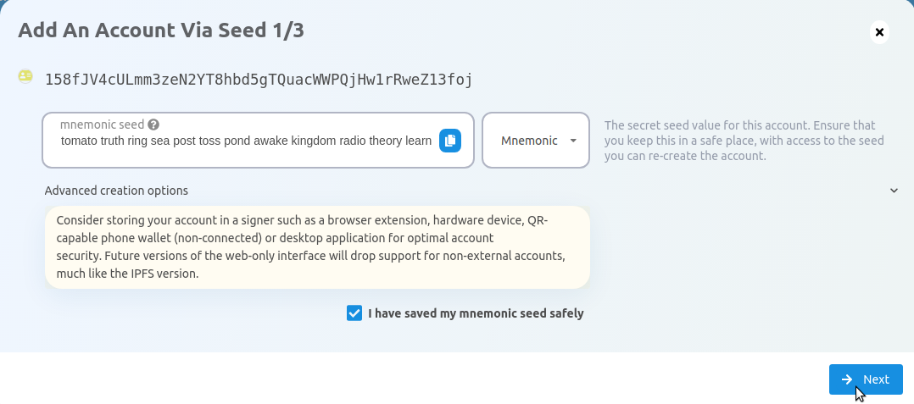
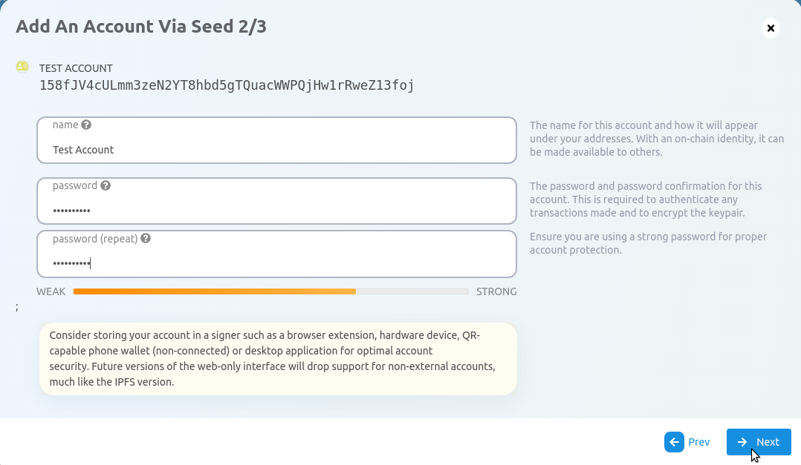
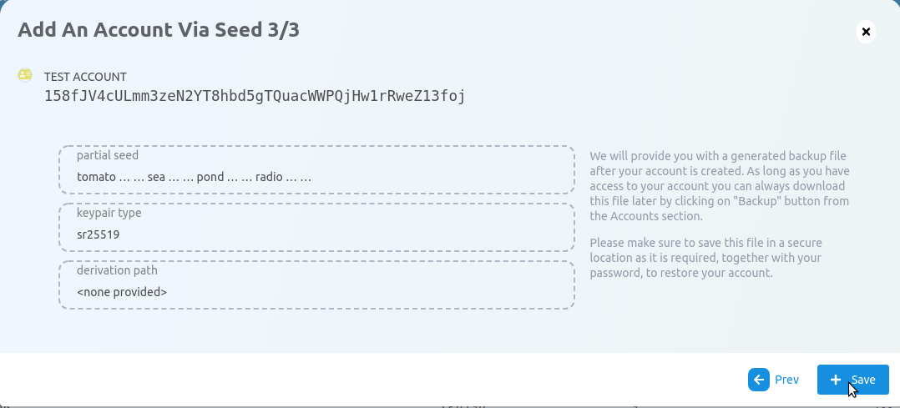

### Go to AXIA-JS Apps

Navigate to [AXIA-JS Apps](https://apps.test.axiacoin.network/?rpc=wss%3A%2F%2Fwss.test.axiacoin.network#/accounts) and click on "Accounts" underneath the
Accounts tab. It is located in the navigation bar at the top of your screen.

### Start Account Generation

Click on the "Add Account" button.

The explorer will then use system randomness to make a new seed for you and display it to you in the form of twelve words.

### Name Account​
The account name is arbitrary and for your use only. It is not stored on the blockchain and will not be visible to other users who look at your address via a block explorer. If you're juggling multiple accounts, it helps to make this as descriptive and detailed as needed.

### Enter Password​
The password will be used to encrypt this account's information. You will need to re-enter it when using the account for any kind of outgoing transaction or when using it to cryptographically sign a message.

Note that this password does NOT protect your seed phrase. If someone knows the twelve words in your mnemonic seed, they still have control over your account even if they do not know the password.

### Create and Back-Up Account

Click “Save” and your account will be created. It will also generate a
backup JSON file that you should safely store, ideally on a USB
off the computer you're using. You should not store it in cloud storage, email it to yourself, etc.

You can use this backup file to restore your account. This backup file is not readable unless it is
decrypted with the password.

Your account will be successfully created and added in the Accounts list.

