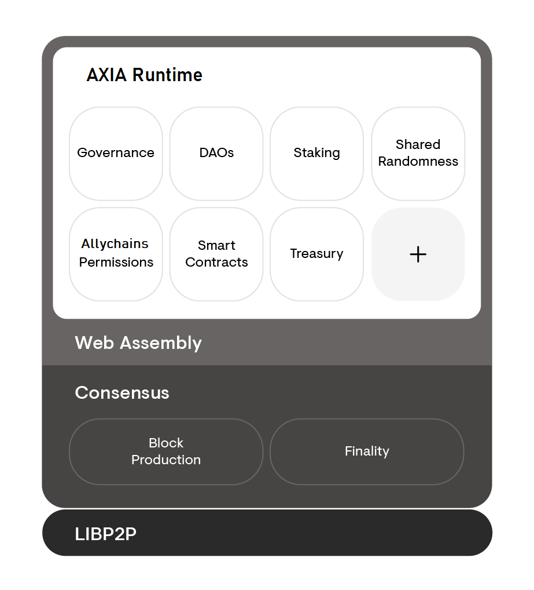

The architecture of AXIA can be divided into two different parts, the AXIA _runtime_ and the
AXIA _host_. The AXIA runtime is the core state transition logic of the chain and can be
upgraded over the course of time and without the need for a hard fork. In comparison, the AXIA
host is the environment in which the runtime executes and is expected to remain stable and mostly
static over the lifetime of AXIA.

The AXIA host interacts with the AXIA runtime in limited, and well-specified ways. For this
reason, implementation teams can build an alternative implementation of the AXIA host while
treating the AXIA runtime as a black box. For more details of the interactions between the host
and the runtime, please see the [specification][].

## Components of the AXIA host

- Networking components such as Libp2p that facilitates network interactions.
- State storage and the storage trie along with the database layer.
- Consensus engine for GRANDPA and BABE.
- Wasm interpreter and virtual machine.
- Low level primitives for a blockchain, such as cryptographic primitives like hash functions.

A compiled AXIA runtime, a blob of Wasm code, can be uploaded into the AXIA host and used as
the logic for the execution of state transitions. Without a runtime, the AXIA host is unable to
make state transitions or produce any blocks.

## Diagram

Below is a diagram that displays the AXIA host surrounding the AXIA runtime. Think of the
runtime (in white) as a component that can be inserted, swapped out, or removed entirely. While the
parts in grey are stable and can not change without an explicit hard fork.

## Resources

- [AXIA Host Protocol Specification](https://github.com/axia-tech/AXIA-spec) - Incubator for the
  AXIA Host spec, including tests.
- [ChainSafe's Go AH](https://github.com/ChainSafeSystems/go-pre) is a 25-person development team
  based in Toronto, Canada. ChainSafe is building an implementation of the beacon chain for Ethereum
  2.0 client in TypeScript and this Go implementation of AXIA.

[specification]: https://github.com/axia-tech/AXIA-spec/
